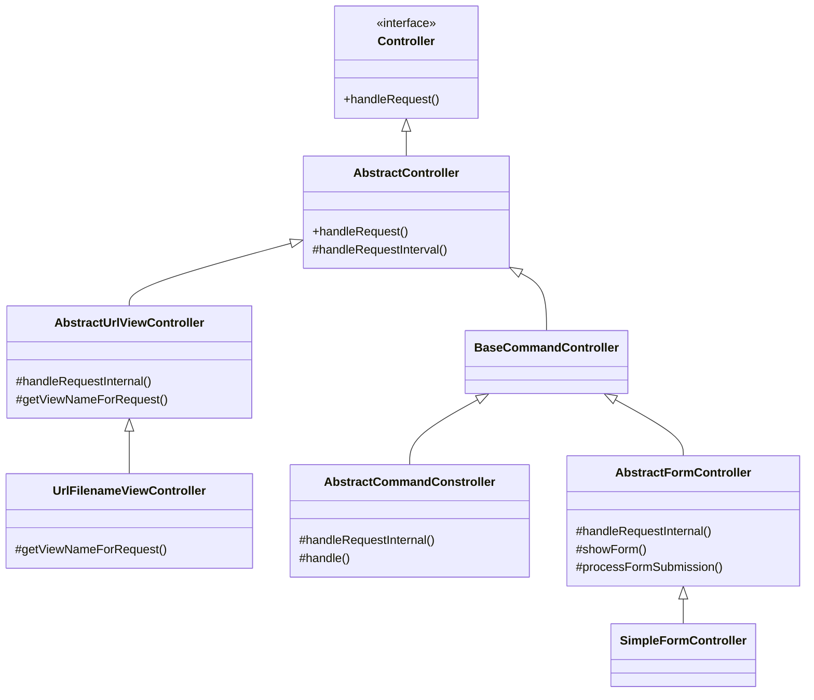

# Chapter4. 재사용: 상속보단 조립

> 1. 상속과 재사용   
1.1. 상속을 통한 재사용의 단점 1. 상위 클래스 변경의 어려움  
1.2. 상속을 통한 재사용의 단점 2. 클래스의 불필요한 증가      
1.3. 상속을 통한 재사용의 단점 3. 상속의 오용     
> 2. 상속과 재사용   
2.1. 위임    
2.2. 상속은 언제 사용하나?     

 

## 목차   

[개요](#개요)  
 
1. [상속을 통한 재사용의 단점 - 상위 클래스 변경의 어려움](#1-상위-클래스-변경의-어려움)  
2. [상속을 통한 재사용의 단점 - 클래스의 불필요한 증가](#2-클래스의-불필요한-증가)   
3. [상속을 통한 재사용의 단점 - 상속의 오용](#3-상속의-오용)   

  

## 개요
> *p.87 "상속을 사용하면 상위 클래스에 구현된 기능을 그대로 재사용할 수 있기 때문에, `상속을 사용하면 재사용을 쉽게` 할 수 있는 것은 분명하다. 하지만 상속을 사용할 경우 몇 가지 문제점이 있는데 ..."*

 

## 1. 상위 클래스 변경의 어려움

- 웹 요청을 처리하기 위한 클래스  
- 하위 클래스가 상위 클래스의 기능을 확장하고 있다. 

  

## 2. 클래스의 불필요한 증가

  

## 3. 상속의 오용

  
  
