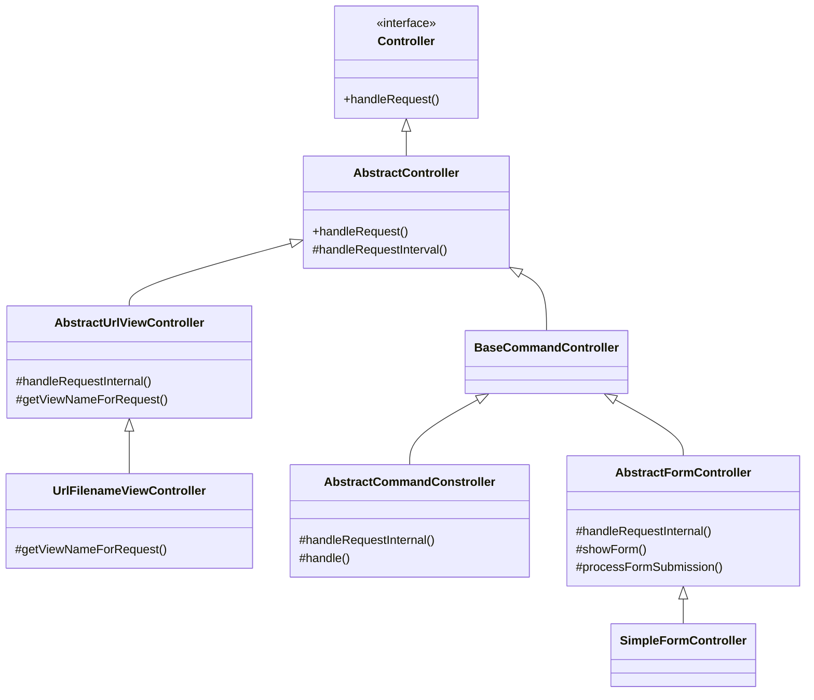
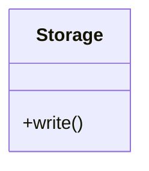
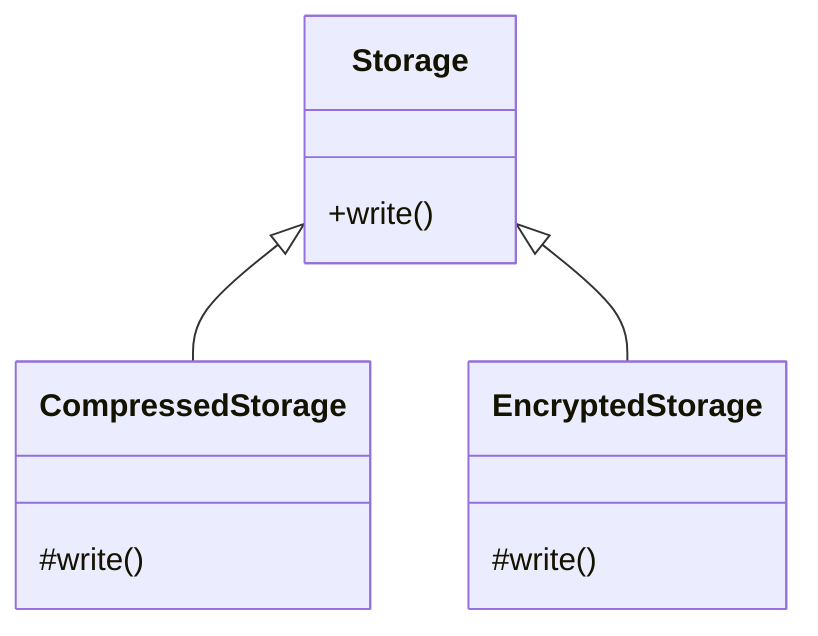
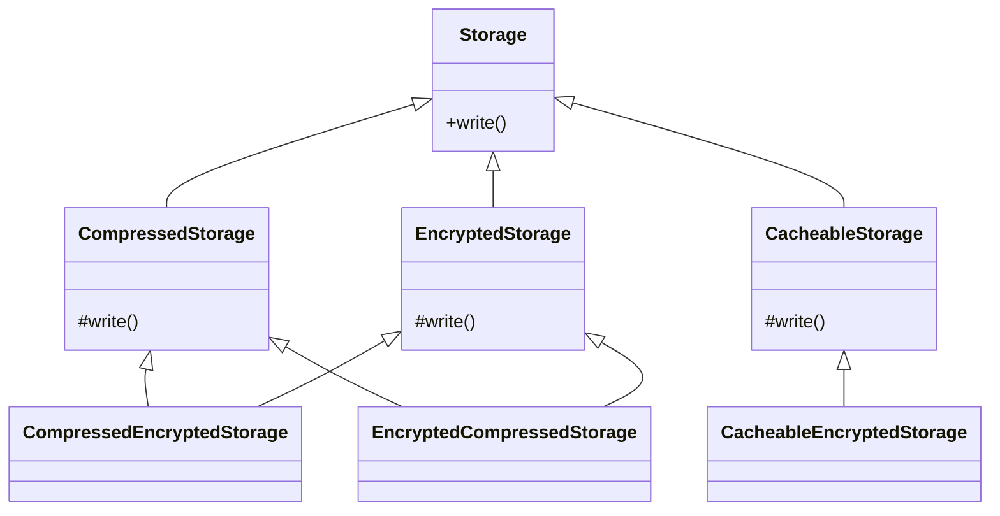

# Chapter4. 재사용: 상속보단 조립

> 1. 상속과 재사용   
1.1. 상속을 통한 재사용의 단점 1. 상위 클래스 변경의 어려움  
1.2. 상속을 통한 재사용의 단점 2. 클래스의 불필요한 증가      
1.3. 상속을 통한 재사용의 단점 3. 상속의 오용     
> 2. 상속과 재사용   
2.1. 위임    
2.2. 상속은 언제 사용하나?     

</br>

## 목차   

[개요](#개요)  
</br>
1. [캡슐화 손상](#1-캡슐화-손상)  
2. [결합도 증가](#2-결합도-증가)  
3. [클래스 폭발(= 조합의 폭발) 문제](#3-클래스-폭발-문제)  
4. [상속 오용의 문제](#4-상속-오용의-문제)  

</br> 

## 개요
### 1. 상속?
- inheritance
- 객체들 간의 관계를 구축하는 방법  
- 기존 클래스에 `기능을 추가`하거나 `재정의`하여 새로운 클레스를 정의하는 것.  

### 2. 상속의 장점? 
- 기존 클래스의 속성(자료/함수) 재사용  
=> 코드를 재사용할 수 있다.  
=> 중복 코드 감소.  

- 다형성 구현 가능.  
- 클래스 간의 계층적 분류를 통해, 클래스들의 구조적 관계 파악 용이.  

### 3. 상속의 문제점 및 한계점? 
> *"상속은 마냥 좋은 것인가?"*
🙅‍♀️  
</br>
- 상속은 중복을 제거하기에 아주 좋은 객체지향 기술로 보인다. 
- 하지만, 상속이 갖는 단점은 상당히 치명적이기 떄문에, 상속을 사용해야 하는 경우는 선택적이다. 
- 그렇다면, 상속으로 인해 발생할 수 있는 문제점은 무엇인가? 
</br>

## 1. 캡슐화 손상
1) 캡슐화(; encapsulation)
- 객체의 속성과 행위를 하나로 묶고, 
- 실제 구현 내용 일부를 내부에 감추어 `은닉한다`. 

2) 오버라이딩
- 오버라이딩은 은닉화의 관점에서 `캡슐화를 손상`시킨다. 
ex. 
```cs
public class Car
{
      public virtual void Run()
      {
            Console.WriteLine("달리다");
      }
}

public class SuperCar : Car
{
      public override void Run()
      {
            Console.WriteLine("빨리 달리다");
      }
}
```
- 부모의 메써드를 자식이 재정의하고 있고  
- 부모 메써드의 구현부가 노출되었고  
- 심지어 아예 새로운 구현부가 만들어진 상황  

=> 은닉화의 관점에서 캡슐화가 손상되었다.

</br></br>

## 2. 결합도 증가
- 상속을 하게되면, 하위 클래스가 상위 클래스에 강하게 결합.
- 상위 클래스의 메써드 시그니처나 필드 정의가 변경되면, 하위 클래스가 영향을 받게 된다. 

ex. 
```cs
public class Document
{
      public int GetLength()
      {
            return GetContent().Length;
      }
      public string GetContent()
      {
            // todo...
      }
}

public class CustomDocument : Document 
{
      public string GetCustomDocument()
      {
            string newContent = string.Empty;
            var originContent = GetContent();
            // ... 
            
            return newContent;
      }
}
```
- * 자식 클래스가 부모 클래스의 메써드를 직접 호출하고 있다. 
- GetContent() 메써드의 리턴 타입이 string에서 char[]로 바뀌었다면? 
- 계층이 깊은 경우, 최상위 클래스의 변경이 말단 클래스까지 영향을 줄 수 있다.  
   


=> 상속은 클래스 간 결합도를 높이고, 클래스의 응집도는 낮춰  
자식 클래스를 수동적인 객체로 만들어버릴 수 있다.  

</br></br>

## 3. 클래스 폭발 문제
- 유사한 기능을 확장하는 과정에서, 클래스가 불필요하게 증가할 수 있다.   
ex. 
- 파일 보관소를 구현한 Storage 클래스.  


> "용량이 부족하니, 파일을 압축해서 저장해줘."         => CompressedStorage  
> "보안 강화가 필요하니, 파일을 암호화해서 저장해줘."   => EncryptedStorage  
   

   
> "압축을 먼저하고, 암호화해서 저장해줘."     => CompressedEncryptedStorage  
> "암호화를 먼저하고, 압축해서 저장해줘."     => EncryptedCompressedStorage  
> "캐시가 적용된 저장소가 필요해."           => CacheableStorage  
> "암호화된 저장소에 캐시 적용이 필요해."     => CacheableEncryptedStorage  



- 필요한 기능의 조합이 증가할수록, 상속을 통한 기능 재사용을 하면 클래스의 개수는 함께 증가하게 된다.  

</br></br>
  
## 4. 상속 오용의 문제

</br></br>
  
