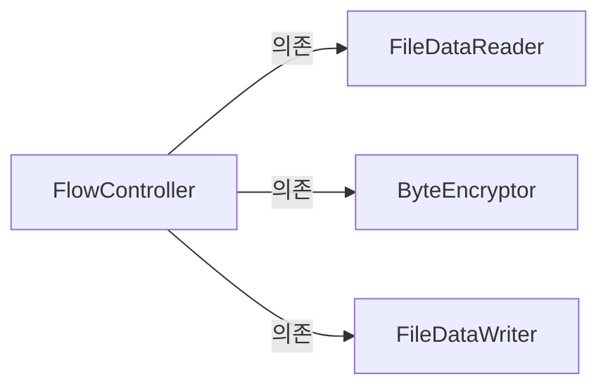
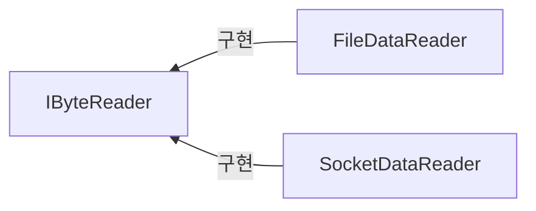

# Chapter5. 설계 원칙: SOLID

> 5. 의존 역전 원칙(Dependency Inversion principle)   
5.1. 고수준 모듈이 저수준 모듈에 의존할 때의 문제   
5.2. 의존 역전 원칙을 통한 변경의 유연함 확보        
5.3. 소스 코드 의존과 런타임 의존        
5.4. 의존 역전 원칙과 패키지        

</br>

## 목차   

[개요](#개요)  
</br>
1. [상위 모듈, 하위 모듈](#1-상위-모듈-하위-모듈)  
2. [결합도 증가](#2-결합도-증가)  
3. [클래스 폭발(= 조합의 폭발) 문제](#3-클래스-폭발-문제)  
4. [상속 오용의 문제](#4-상속-오용의-문제)  

</br> 

## 개요 	
[의존 관계 역전 원칙](https://ko.wikipedia.org/wiki/%EC%9D%98%EC%A1%B4%EA%B4%80%EA%B3%84_%EC%97%AD%EC%A0%84_%EC%9B%90%EC%B9%99)  

- 상위 모듈은 `하위 모듈에 의존하면 안된다`.   
- 상위와 하위 객체 모두가 `동일한 추상화에 의존`해야 한다.   

</br>

## 1. 상위 모듈, 하위 모듈 
**1) 상위 모듈(= 고수준 모듈)**   
- 어떤 `의미 있는 단일 기능`을 제공하는 모듈  

**2) 하위 모듈(= 저수준 모듈)**   
- 고수준 모듈의 `단일 기능을 구성하는 하위 기능`을 구현하는 모듈  

**3) 예시** 
- FlowController (상위 모듈) 
>파일에서 바이트 데이터를 읽어와 (→ `하위 기능 1`)  
>암호화 하고  (→ `하위 기능 2`)   
>파일에 결과 데이터를 쓴다.    (→ `하위 기능 3`)   

- FileDataReader (하위 모듈)  
- ByteEncryptor   
- FileDataWriter   


- `상위 모듈이 하위 모듈에 의존`하고 있음.   
- `의존 관계 역전 원칙 위배`하는 사례.   

</br>

- 🙋 상위 모듈이 하위 모듈에 의존하면 안되나?
- 안된다.   

</br>

```c#
public class FileDataReader
{
  public byte[] Read()
  {
    //...
  }
}

public class FlowController 
{
  public void process()
  {
    //(1) 파일에서 읽어오기
    var reader = new FileDataReader();
    byte[] datas = reader.Read();
    
    //(2) 읽어온 데이터를 암호화 
    //(3) 파일에 암호화된 데이터를 쓰기
    //todo...
  }
}
```

- 상위 모듈과 하위 모듈의 의존 관계를 코드로 구현한 것.    
- 어떤 문제가 있을까요?  

</br>

- 유지 보수에 취약하다.    
- 시간이 지나 파일 뿐만 아니라 `소켓`을 통해서도 데이터를 읽어올 수 있도록 해달라는 `새로운 요구사항이 등장`한 경우.   
→ 상위 모듈이 수정되어야 한다.    
→ 하위 모듈의 변경이 상위 모듈의 변경을 유발한다.   
→ 결합도는 높고 응집도는 낮은 코드.     
→ 이해가기 어려운 코드가 생산되고, 유지보수가 어려워 짐.   
→ 나쁜 코드.     
  
</br>

- 어떻게 개선하면 좋을까❔  
→ 상위 모듈이 하위 모듈에 의존하지 않도록 수정해야 한다.  
→ 의존 역전 원칙에 따르면, 상위와 하위 객체 모두가 `동일한 추상화에 의존`해야 한다.   

</br>

- AS-IS  


</br>
> 의존 관계 역전 원칙에 따라 수정한 구조도  
  
- TO-BE





