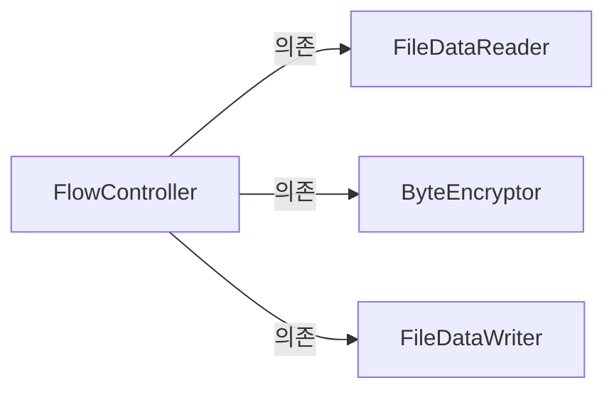
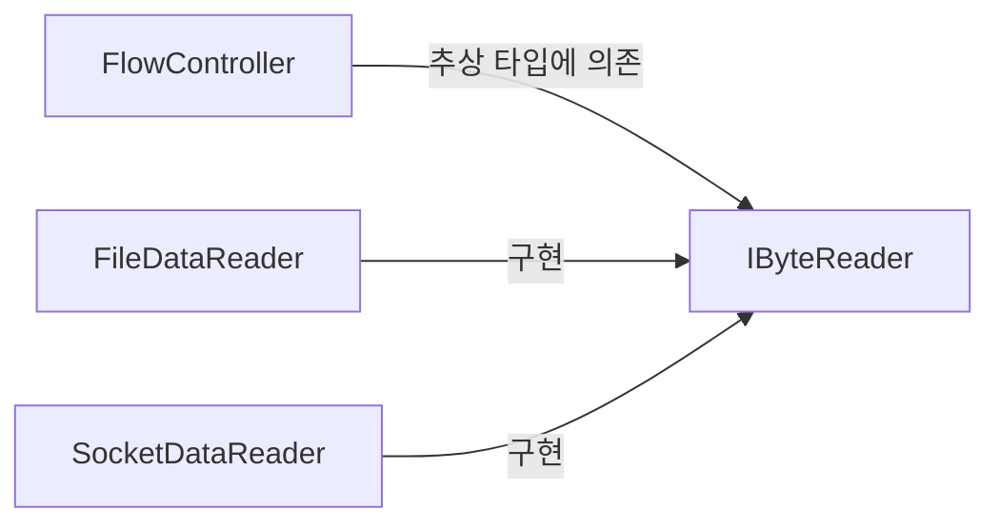

# Chapter5. 설계 원칙: SOLID

> 5. 의존 역전 원칙(Dependency Inversion principle)   
5.1. 고수준 모듈이 저수준 모듈에 의존할 때의 문제   
5.2. 의존 역전 원칙을 통한 변경의 유연함 확보        
5.3. 소스 코드 의존과 런타임 의존        
5.4. 의존 역전 원칙과 패키지        

</br>

## 목차   

[개요](#개요)  
</br>
1. [캡슐화 손상](#1-캡슐화-손상)  
2. [결합도 증가](#2-결합도-증가)  
3. [클래스 폭발(= 조합의 폭발) 문제](#3-클래스-폭발-문제)  
4. [상속 오용의 문제](#4-상속-오용의-문제)  

</br> 


## 1. 고수준 모듈과 저수준 모듈
### 1. 정의
**1) 고수준 모듈**  
- 어떤 `의미 있는 단일 기능`을 제공하는 모듈  

**2) 저수준 모듈**  
- 고수준 모듈의 `단일 기능을 구성하는 하위 기능`을 구현하는 모듈  

</br>

### 2. 예시    
**1) 고수준 모듈**     
- FlowController: `(1)`파일에서 바이트 데이터를 읽어와 / `(2)`암호화 하고 / `(3)`파일에 결과 데이터를 쓴다.  

**2) 저수준 모듈**    
- `(1)` FileDataReader: 파일에서 바이트 데이터를 읽어오는 모듈  
- `(2)` ByteEncryptor: AES 알고리즘으로 암호화하는 모듈  
- `(3)` FileDataWriter: 파일에 결과 데이터를 쓰는 모듈  

⇨
   


```c#
// 저수준 모듈
public class FileDataReader
{
  public byte[] Read()
  {
    //...
  }
}

// 고수준 모듈
public class FlowController 
{
  public void process()
  {
    // (1) 파일에서 읽어오기
    var reader = new FileDataReader();
    byte[] datas = reader.Read();
    
    // (2) 읽어온 데이터를 암호화 
    // (3) 파일에 암호화된 데이터를 쓰기
    // todo...
  }
}
```
- FlowController클래스가 FileDataReader클래스에 `직접적으로 의존`하고 있다.     
- Q. *"파일 뿐만 아니라 소켓을 통해서도 데이터 읽을거야."* 라는 새로운 요구사항이 등장한다면?   
- A. 현 구조를 유지한다면, 요구사항이 추가될 때마다 고수준 모듈에 변경이 생김.  
  => 즉, `저수준 모듈의 변경이 고수준 모듈 변경을 유발`    
  => 이해하기 어려운 코드를 생산하고, 유지보수를 어렵게 만듦.  
  
</br>

- Q. 그렇다면, 고수준 모듈이 저수준 모듈의 구현으로부터 독립되게 하려면 어떻게 해야 할까?*
- A. 의존 역전 원칙
  => 의존 역전 원칙은 `저수준 모듈이 고수준 모듈을 의존`하게 만들어 이러한 문제를 해결한다.     
  => 즉, `의존이 역전`되는 것임.  
  => How is it possible?!  
  => **추상화**
  
</br>


## 2. 의존 역전 원칙을 통한 변경의 유연성 확보

- AS-IS


- TO-BE


</br>

- FlowController는 추상화된 IByteReader 인터페이스에 의존하지만,   
- 하지만 구체화된 FileDataReader 클래스에는 의존하지 않는다.  

</br>

- 고수준 모듈과 저수준 모듈이 `모두 추상 타입에 의존`하게 만듦으로써  
- 고수준 모듈의 변경 없이 저수준 모듈을 변경할 수 있는 유연함을 얻게 되었다.  

</br>

## 3. 소스 코드 의존과 런타임 의존


=>   
"추상화에 의존해야지, 구체화에 의존하면 안된다"

